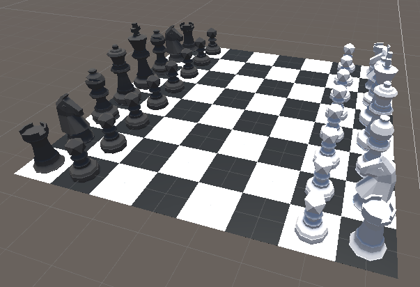

# Realm Unity SDK - Examples Repository

Realm is a mobile database that runs directly on phones, tablets or wearables.

The [Realm .NET SDK](https://github.com/realm/realm-dotnet/) also added Unity3D support in July 2021.

In this reposity we show you examples of how you can use Realm to enhance your games created in Unity3D.

## 3D Chess

This tutorial shows how to use local and synced Realms to add persistence to your games. It's a fully functional, multi player game and the tutorial will walk you through the whole process from creating a new Unity3D project to the final, playable product.

[The first part shows the local Realm](https://github.com/realm/unity-examples/blob/3d-chess/local-realm/tutorial/unity_local_realm.md).

[In the second part we then look at how to turn the local Realm into a synced Realm to connect to other players.](https://github.com/realm/unity-examples/blob/3d-chess/synced-realm/tutorial/unity_sync_realm.md)

## Series: Persistence comparison

In this tutorial series we will explore the options given to us by Unity and third party libraries. Each part will take a deeper look into one of them with the final part being a comparison:

- Part 1: [PlayerPrefs](https://github.com/realm/unity-examples/blob/persistence-comparison/tutorials/persistance-comparison-series/PlayerPrefs/player_prefs.md)
- Part 2: Files *(coming soon)*
- Part 3: BinaryReader and BinaryWriter
- Part 4: SQL
- Part 5: Realm Unity SDK
- Part 6: Comparison of all those options

They can all be found as one combined project on the [persistence-comparison branch](https://github.com/realm/unity-examples/tree/persistence-comparison) in this repository.
